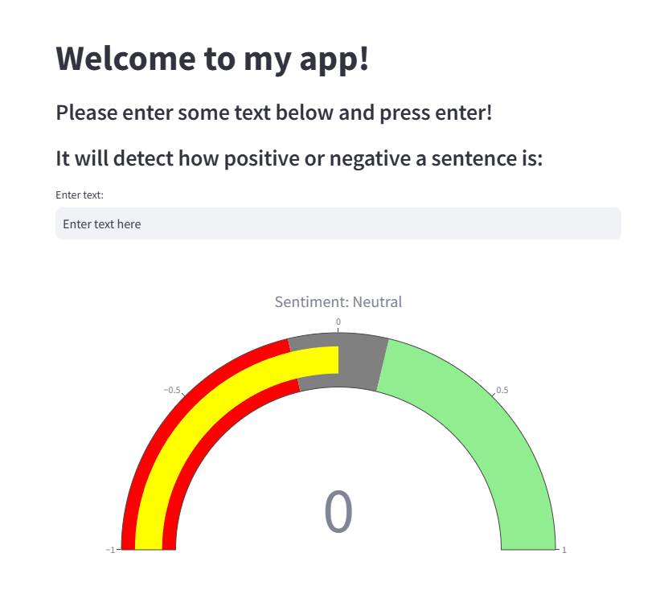

# Sentiment Analysis App

## About
This is a Streamlit-based web application that analyzes the sentiment of user-provided text. The app uses the TextBlob library to determine whether the sentiment of the text is positive, negative, or neutral and visualizes the sentiment score on a gauge plot using Plotly.

---

## Features
- **User Input**:
  - Enter any text to analyze its sentiment.
- **Sentiment Classification**:
  - Sentiment is categorized as:
    - **Positive** (Score > 0.15)
    - **Neutral** (-0.15 ≤ Score ≤ 0.15)
    - **Negative** (Score < -0.15)
- **Gauge Plot Visualization**:
  - Displays the sentiment score on a gauge plot with the following ranges:
    - **Negative**: Red (-1 to -0.15)
    - **Neutral**: Gray (-0.15 to 0.15)
    - **Positive**: Green (0.15 to 1)

---


## Key Visualization
### Photo of the App


---
## Tools & Technologies
- **Programming Language**: Python
- **Framework**: Streamlit
- **Libraries**:
  - Sentiment Analysis: `TextBlob`
  - Data Visualization: `Plotly`

---

## How to Run the App
1. Clone the repository:
   ```bash
   git clone https://github.com/username/sentiment-analysis-app.git
